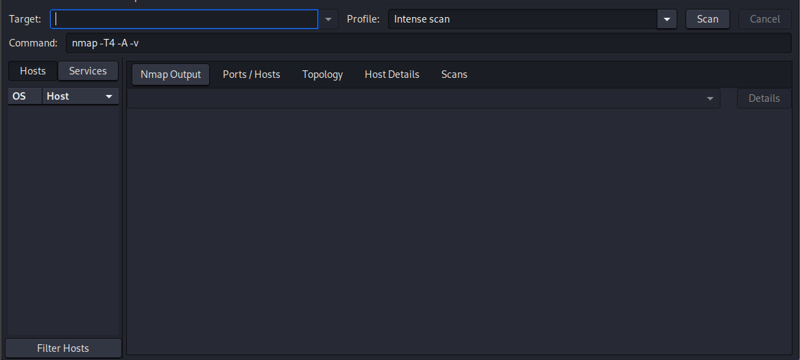
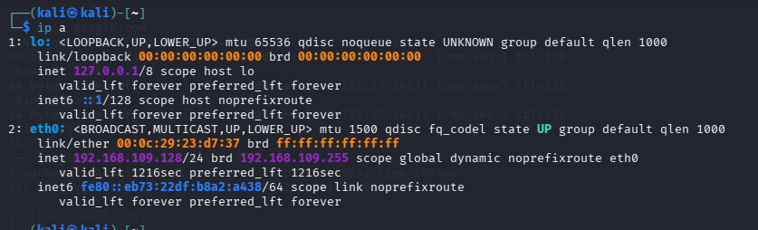
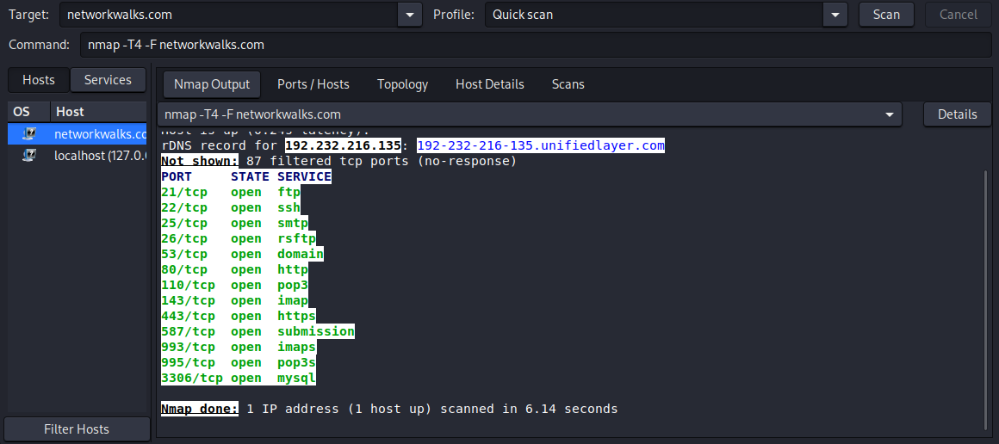
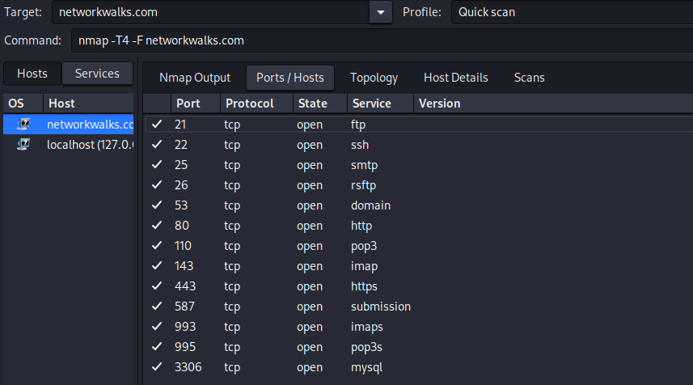

# NETWORKWALKS-ZAIN-UL-ABIDIN-B083-WK2-PM5-NETWORK-SCANNING-ZENMAP

**Network Scanning with Zenmap**

---

## 📌 Project Overview

This project focuses on using **Zenmap**, the official GUI version of Nmap, to perform basic network scanning on a local LAN subnet — discovering live hosts, their IP and MAC addresses, and visualizing the network topology.

---

## 🎯 Objectives

- Confirm Zenmap is available (comes pre-installed on Kali Linux, alongside Nmap).
- Find the local IP address and LAN subnet.
- Find the list of live hosts/PCs in the IP subnet using a Ping Scan.
- Determine how many hosts are live in the subnet.
- Identify the IP addresses of the live hosts.
- Identify the MAC addresses of the live hosts.
- Display and save the output topology in PDF format.

---

## 🛡️ Ethical Use

This lab is intended for **educational and authorized security testing only**.

Only the local lab subnet (own VM network) was scanned, with due authorization as part of this training exercise.

---

# 🧠 Background

Zenmap is the official GUI version of Nmap. It is a security scanner tool used by cybersecurity professionals and hackers alike. It is multi-platform (Linux, Windows, Mac OS X, BSD, etc.), free, and open source — aiming to make Nmap easy for beginners while still offering advanced features for experienced users. Frequently used scans can be saved as profiles to make them easy to run repeatedly.

**Note:** The instructor used a `10.0.0.0/24` subnet in the original lab guide. Results here will differ based on the actual local subnet used, but the method and steps remain the same.

---

# 🪜 Tasks & Solutions

## Task 1 — Confirm Zenmap is Available

**Objective:** Ensure Zenmap is installed and ready to use.

**Solution Steps:**
1. Zenmap comes pre-installed on Kali Linux along with Nmap.
2. Open it from the Applications menu by searching for **"Zenmap"**, or launch it from the terminal:
   ```bash
   sudo zenmap
   ```
3. The Zenmap GUI opens, ready for scanning.

### Screenshot


---

## Task 2 — Find Local IP Address & LAN Subnet

**Objective:** Find the local IP address and LAN subnet of the machine.

**Solution Steps:**
1. Open a terminal in Kali Linux.
2. Run the following command to view network interface details:
   ```bash
   ip a
   ```
3. Note the IP address and subnet mask (e.g. `10.0.0.2/24`) for the active network interface.

### Screenshot


---

## Task 3 — Find Live Hosts in the Subnet

**Objective:** Find the list of live hosts/PCs in the IP subnet.

**Solution Steps:**
1. Open Zenmap.
2. In the **Target** field, enter the local LAN subnet (e.g. `10.0.0.0/24`).
3. In the **Profile** dropdown, select **Ping scan**.
4. Click **Scan**. Zenmap runs the equivalent command:
   ```bash
   nmap -sn 10.0.0.0/24
   ```
5. Review the results under the **Hosts** tab and the **Nmap Output** tab.

### Screenshot


---

## Task 4 — How Many Hosts Are Live?

**Objective:** Determine how many hosts are live in the subnet.

**Answer:** Based on the ping scan results, the total number of live hosts found (including the scanning machine itself) is noted from the "Nmap done" summary line in the output (e.g. *"X hosts up"*).

---

## Task 5 — IP Addresses of Live Hosts

**Objective:** List the IP addresses of the live hosts.

**Answer:** Each live host's IP address is listed under the **Hosts** tab in Zenmap and in the Nmap Output (e.g. "Nmap scan report for `<IP>`").

---

## Task 6 — MAC Addresses of Live Hosts

**Objective:** List the MAC addresses of the live hosts.

**Answer:** Each live host's MAC address is shown in the Nmap Output next to its IP (e.g. "MAC Address: `XX:XX:XX:XX:XX:XX`"). For the local machine's own MAC address, run:
```bash
ip link show
```
or
```bash
ifconfig -a
```

### Screenshot


---

## Task 7 — Save Output Topology as PDF

**Objective:** Display and save the output topology in PDF format.

**Solution Steps:**
1. In Zenmap, click on the **Topology** tab.
2. Turn on the **Legend** to understand the icons and connection types shown.
3. Click **Save Graphic**.
4. In the file type dropdown, select **PDF**.
5. Choose a save location (e.g. Desktop) and save the file.

### Screenshot


---

# 💡 Extra References & Tips

- Zenmap and Nmap have been featured in several Hollywood movies during hacking scenes, including *The Matrix Reloaded* (2003), *Ocean's 8* (2018), *Snowden* (2016), *Dredd* (2012), and *Elysium* (2013). Full list: https://nmap.org/movies/
- Nmap has also been referenced in numerous news articles, reviews, books, and popular culture references: https://nmap.org/nmap_inthenews.html

---

# 💡 Why Network Scanning with Zenmap Matters

Network scanning is a core step in understanding what devices exist on a network before any further security assessment can take place. Zenmap turns Nmap's powerful command-line scanning engine into a visual, beginner-friendly tool — showing live hosts, their IPs, MAC addresses, and even a topology map of how the network is laid out. This same technique used by defenders to map and secure their own networks is exactly what an attacker would use to identify targets after gaining access to a network segment.

---

# 💡 What I Learned

### 1. GUI-Based Network Scanning
I learned how Zenmap simplifies Nmap scanning through a graphical interface, while still generating the same underlying Nmap commands.

### 2. Host Discovery
I learned how a Ping Scan (`nmap -sn`) can quickly reveal all live hosts on a subnet without doing a full port scan.

### 3. Reading Scan Output
I learned how to identify the number of live hosts, their IP addresses, and their MAC addresses directly from the Nmap Output.

### 4. Visualizing Network Topology
I learned how the Topology tab in Zenmap visually represents discovered hosts and their relationships, and how to export this as a PDF for reporting.

### 5. Documentation
I learned how to properly record scan results — screenshots, IP/MAC lists, and topology exports — for a professional report.

---

# 🔐 Security & Ethical Use

This lab is created for learning and cybersecurity practice.

All scanning was performed only on the local lab subnet, with authorization, as part of this training exercise.

---

# 🔗 Tools & Resources

- **Nmap / Zenmap Download:** https://nmap.org/download.html
- **Nmap Movies List:** https://nmap.org/movies/
- **Lab Practice Page:** https://networkwalks.com/zenmap-network-scanning-practice-lab/

---

# 👤 Author

**Zain ul Abidin**

**Cyber Security Student B083**

---

## 📌 Project Information

**Program Name:** Cybersecurity at Networkwalks
**Week:** 02
**Project Module:** PM5 — Network Scanning with Zenmap
**Author:** Zain ul Abidin
**B-Number:** B083
**Repository:** GitHub
