# PENETRATION TESTING REPORT
## FOOTPRINTING & NETWORK SCANNING PHASES
### W2-PM-FINAL | CYBERSECURITY | NETWORKWALKS

| | |
|---|---|
| **Pentester Name** | Zain ul Abidin |
| | (Cybersecurity Student) |
| **Program/Batch** | B083-Networkwalks |
| **Date** | 14 September 2026 |
| **Modules completed** | W2-PM1 (Multiple Kali Tools) |
| | W2-PM2 (Footprinting with GHDB) |
| | W2-PM3 (Footprinting with Maltego) |
| | W2-PM4 (Footprinting with theHarvester) |
| | W2-PM5 (Zenmap Scanning) |
| **Client/Target** | 1. Networkwalks (secured written permission already) |
| | 2. microsoft.com (publicly documented lab example target) |
| | 3. My own local LAN Network |
| **Permission secured from client?** | Yes |
| **Phases covered** | Phase 1: Reconnaissance & Footprinting |
| | Phase 2: Scanning & Network Discovery |
| | Phase 3-5: In Progress |

---

## 1. Liability Disclaimer

I have performed these activities only on the systems & devices where I had secured written permission or the devices/systems that I own myself. All these materials are for education and research purpose only. Do not use anything from here to break the law. The instructor, the authors and Networkwalks are not responsible for what you do with this knowledge. Every action you take is your own responsibility. Misuse can lead to criminal charges, heavy fines, loss of your job and a permanent record. In most countries unauthorised access is a crime even when nothing is damaged.

---

## 2. Introduction

This report covers five footprinting and scanning modules completed during Week 2 of my Cybersecurity & Ethical Hacking internship at Networkwalks:

- **W2-PM1** — Footprinting the `networkwalks.com` domain using multiple Kali Linux tools.
- **W2-PM2** — Footprinting via the Google Hacking Database (GHDB) to locate publicly exposed cameras and file listings.
- **W2-PM3** — Footprinting with Maltego, an OSINT/link-analysis tool, to harvest email addresses tied to `networkwalks.com`.
- **W2-PM4** — Footprinting with theHarvester to gather emails and sub-domains for `microsoft.com` using different data sources.
- **W2-PM5** — Scanning my own local network with Zenmap to identify live hosts.

Together, these modules show how an attacker moves from gathering public information about an organization, to using automated OSINT tools, to actively discovering live hosts on a network. All tools were run in Kali Linux. Every activity below includes the method used, the result observed, screenshot evidence (referenced by filename), and a short note on why the finding matters from an attacker's point of view.

---

## 3. Tools Used

| Tool | Purpose |
|---|---|
| Kali Linux | Operating system used for all reconnaissance and scanning activities |
| WHOIS | Find domain registration details (owner, dates, name servers) |
| whatweb | Fingerprint web technologies (server, CMS, plugins, IP) |
| nslookup | Resolve the domain name to its IP address using DNS |
| curl -I | Read the HTTP response headers of the website |
| wafw00f | Detect whether a Web Application Firewall protects the site |
| dnsrecon | Enumerate all DNS records (NS, MX, SPF, TXT, SRV) |
| GHDB (exploit-db.com) | Find ready-made Google dorks for locating exposed devices and files |
| Google Search | Run GHDB dorks to surface exposed cameras and open directory listings |
| Maltego | OSINT / graphical link-analysis tool used to harvest email addresses from a domain |
| theHarvester | Python-based OSINT tool used to gather emails and sub-domains from multiple public sources |
| Zenmap (Nmap GUI) | Scan the local subnet to find live hosts, IPs and MAC addresses |
| `ip a` / `ip link show` | Local IP, subnet and MAC address identification on Kali Linux |

---

## 4. Activities Performed

### 4.1 Footprinting with Multiple Kali Tools (W2-PM1)

I performed reconnaissance against the `networkwalks.com` domain using six Kali Linux tools: WHOIS, WhatWeb, Nslookup, Curl, Wafw00f and DNSRecon. Each tool was used to collect a different type of information about the target.

First, I used **WHOIS** to obtain publicly available domain registration information and identify the domain's name servers. The results showed the domain is registered through GoDaddy, hosted with HostGator name servers.

I then used **WhatWeb** to identify technologies used by the website. The results identified **WordPress 7.0.4** and **WP Download Manager 3.3.58**, along with other information exposed by the website.

Using **Nslookup**, I resolved the domain name to its IP address: **192.232.216.135**.

I used **Curl** with the `-I` option to inspect the HTTP response headers. This provided additional information about the web application and exposed the WordPress REST API endpoint **`/wp-json/`**.

Next, I used **Wafw00f** to determine whether a Web Application Firewall was protecting the website. The result identified **ModSecurity (SpiderLabs)**.

Finally, I used **DNSRecon** to enumerate DNS records. The results provided information relating to name servers, mail servers, SPF/TXT records, service records, and DNS software information (Bind).

---

### 4.2 Footprinting with GHDB (W2-PM2)

I used the **Google Hacking Database (GHDB)** hosted on exploit-db.com to footprint live, exposed devices and files without ever directly touching a target — using pre-built Google dorks executed against Google search alone.

**Task 1 — Exposed Security Cameras:** I found 10 live, publicly accessible security camera feeds (WebcamXP, Webcam 7, NetCamXL, and live-view style interfaces), all accessible without login, using dorks such as `intitle:"webcamXP" inurl:8080` and `intitle:"webcam 7"`.

**Task 2 — Downloadable Mathematics Ebooks:** I found 10 unique, publicly exposed open directory listings containing downloadable mathematics PDF ebooks, using the dork `intitle:index.of "parent directory" mathematics pdf`.

All 20 findings were manually verified and logged with their link, the relevant dork used, and a screenshot as evidence (see README-module2 for the full findings table).

---

### 4.3 Footprinting with Maltego (W2-PM3)

I installed **Maltego** on Kali Linux and used it to footprint `networkwalks.com` (with due permission) through its graphical OSINT interface.

I added a **Domain** entity, set it to `networkwalks.com`, and ran the **"To Email Addresses [Search Engine]"** transform. This returned one connected email address: **`info@networkwalks.com`**.

I also tested the **"To Email Addresses [PGP]"** transform, which returned no results — confirming that not every domain is listed in PGP key directories, and that trying multiple transforms/sources is necessary for a complete picture.

---

### 4.4 Footprinting with theHarvester (W2-PM4)

I used **theHarvester**, a Python-based OSINT tool pre-installed in Kali Linux, to gather email IDs and sub-domains for the target organization `microsoft.com`.

**Task 1:** I ran `theHarvester -d microsoft.com -l 1000 -b baidu`, which queried the Baidu source and returned 1 email address (`viva-noreply@microsoft.com`) and no IPs or hosts.

**Task 2:** I ran `theHarvester -d microsoft.com -l 50 -b all`, which queried all supported sources at once. Several sources (bevigil, Bitbucket, BuiltWith, Brave, bufferoverun) returned "Missing API key" warnings, since these require registered API keys not configured by default — the tool continued gathering results from the remaining available sources regardless.

---

### 4.5 Network Scanning with Zenmap (W2-PM5)

For the final activity, I used **Zenmap** to perform network discovery on my own local network. The practical required me to identify my local IP address and subnet, discover live hosts, identify their IP and MAC addresses, and generate a network topology.

I used the Kali Linux `ip a` command to identify my local IP address and LAN subnet (on my network, a `192.168.x.x/24` subnet rather than the `10.0.0.0/24` example used in the original lab guide). I then entered my subnet into Zenmap and selected **Ping Scan** to identify active hosts.

After completing the scan, I opened the **Topology** section in Zenmap, enabled the legend, and saved the network topology in **PDF format** as required by the practical task.

*Note: The exact subnet, number of hosts, and IP/MAC addresses reflect my own local network at the time of scanning and will differ from the `10.0.0.0/24` example shown in the original lab guide.*

---

## 5. Risk Analysis / Impact

Based on the information collected during the footprinting and scanning activities, I identified the following potential risks.

| # | Risk / Finding | Evidence / Observation | Potential Impact | Risk Level |
|---|---|---|---|---|
| 1 | Web technology information exposed | WhatWeb identified WordPress 7.0.4 and WP Download Manager 3.3.58 | Attackers may use exposed technology/version information to identify software requiring further security review | 🟡 Medium |
| 2 | Server IP address identifiable | Nslookup resolved the domain to 192.232.216.135 | Provides information about the network location of the web service | 🟢 Low |
| 3 | HTTP technical information exposed | Curl returned HTTP response headers and exposed /wp-json/ | May assist technology fingerprinting and further enumeration | 🟢 Low |
| 4 | WAF technology identifiable | Wafw00f identified ModSecurity (SpiderLabs) | Reveals information about the web application's security architecture | 🟢 Low |
| 5 | DNS infrastructure information exposed | DNSRecon identified DNS, mail and service-related records | DNS information can help build a broader infrastructure profile | 🟡 Medium |
| 6 | Publicly exposed live camera feeds discovered via GHDB | 10 live, unauthenticated camera feeds found using Google dorks | Unsecured cameras can give an attacker surveillance access or a foothold into a wider network | 🔴 Critical |
| 7 | Publicly exposed open directory listings discovered via GHDB | 10 unique open directory listings found containing downloadable files | The same dork technique used for ebooks can reveal backups, configs, and credentials on misconfigured servers | 🟡 Medium |
| 8 | Organizational email address harvested via Maltego | `info@networkwalks.com` discovered via a single domain entity and transform | Harvested emails are a starting point for phishing and social engineering | 🟡 Medium |
| 9 | Email addresses and sub-domains harvestable via theHarvester | Emails and hosts collected from Baidu and combined sources for microsoft.com | Aggregated OSINT sources significantly widen the pool of information available to an attacker | 🟡 Medium |
| 10 | Multiple live hosts visible on local network | Zenmap ping scan identified live hosts on the local subnet | Unknown or unauthorized devices may potentially be present on a network | 🟡 Medium |

**Risk level key:** 🔴 Critical 🟡 Medium 🟢 Low

The risks above are observations from the footprinting and scanning exercises, not confirmed vulnerabilities. The practical exercises primarily involved information gathering and host discovery. No exploitation or vulnerability validation was performed as part of these five modules. Therefore, the presence of information such as a software version, IP address, DNS record, or an exposed camera does not by itself confirm exploitation occurred — but it does represent real exposure that an attacker could act on. Further authorized security testing would be required to confirm any actual vulnerability.

---

## 6. Recommendations

Based on the observations from these activities, I recommend the following security improvements:

- **Review publicly exposed technology information** — Organizations should regularly review what information about their web technologies, CMS, and plugins is publicly visible.
- **Keep software updated** — CMS platforms, plugins, and other web technologies should be regularly updated and reviewed against current security advisories.
- **Review HTTP headers** — HTTP response headers should be reviewed to determine whether unnecessary technical information is being exposed.
- **Review DNS records regularly** — DNS records should be checked periodically to ensure that only required information and services are publicly exposed.
- **Properly configure and monitor the WAF** — Keep the WAF (ModSecurity) enabled and tuned, since it already blocks naive attacks.
- **Audit for exposed devices and files** — Organizations should periodically run their own GHDB-style dork searches against their domains to find and secure exposed cameras, directories, or files before attackers do.
- **Secure default-configured devices** — Any internet-facing camera or IoT device should require authentication and never be left on default/no-login configuration.
- **Limit publicly harvestable contact information** — Be mindful of how many email addresses and organizational details are exposed through OSINT-friendly channels, since these directly feed phishing campaigns.
- **Perform regular internal network discovery** — Organizations should periodically scan their own networks to identify active devices.
- **Investigate unknown devices** — Any unexpected device discovered during network scanning should be investigated and verified.
- **Maintain network documentation** — Network topology and device information should be documented and updated regularly.
- **Perform security testing with authorization** — Reconnaissance and scanning should only be performed against systems and networks where appropriate authorization has been provided.

---

## 7. Conclusion

During Week 2 of my Cybersecurity & Ethical Hacking internship, I completed five practical modules covering footprinting, OSINT gathering, and network scanning.

In the multi-tool footprinting activity (W2-PM1), I used six Kali Linux tools to collect information about the target domain, learning how WHOIS, WhatWeb, Nslookup, Curl, Wafw00f, and DNSRecon each reveal a different piece of an organization's public footprint.

In the GHDB activity (W2-PM2), I learned how ordinary Google search, combined with pre-built dorks, can locate live exposed devices and files without ever directly contacting the target — making it one of the quietest forms of reconnaissance.

In the Maltego activity (W2-PM3), I learned how a graphical OSINT tool can turn a single domain into a harvested email address using automated transforms, and how different transforms/sources can return different (or no) results.

In the theHarvester activity (W2-PM4), I learned how combining multiple public sources through a single command-line tool can maximize the amount of OSINT data gathered about a target in one pass.

In the network scanning activity (W2-PM5), I used Zenmap to identify my local network configuration, discover active hosts, collect IP and MAC address information, and create a network topology.

Across all five modules, I learned that information gathering is a foundational part of cybersecurity. Even before attempting to exploit a system, a security professional can learn a significant amount about an environment by carefully analyzing publicly available information and network responses. I also learned that technical findings should be documented clearly — a good cybersecurity report should explain what was performed, what was discovered, what the observation means, what risk it may create, and what can be done to reduce that risk.

Finally, I learned that reconnaissance and scanning must always be performed within an authorized scope. These activities were completed as part of the assigned educational cybersecurity lab.

---

## 8. Evidences Collected

Screenshots and text-file outputs for all five modules are stored in their respective module folders in this repository:

- `module1-footprinting-recon/screenshots/` — WHOIS, WhatWeb, Nslookup, Curl, Wafw00f, DNSRecon outputs
- ### Screenshot

### Screenshot

### Screenshot

### Screenshot

### Screenshot

### Screenshot

- `module2-ghdb/screenshots/` — 10 exposed camera findings + 10 exposed PDF listing findings
- 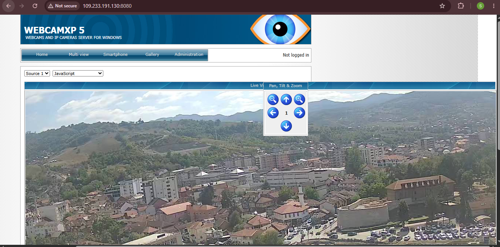
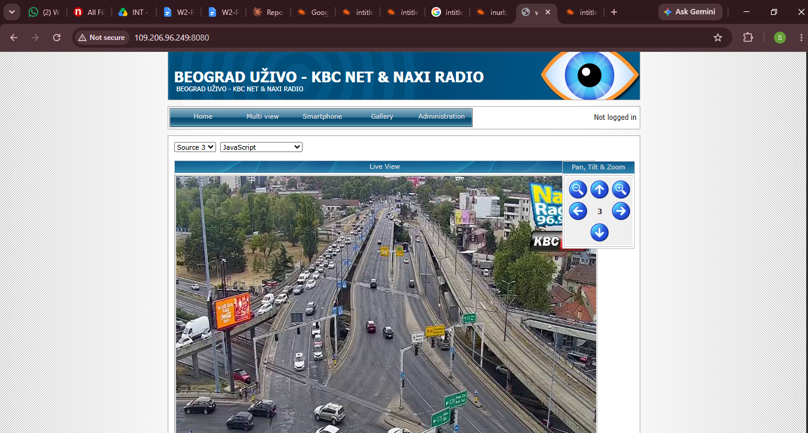
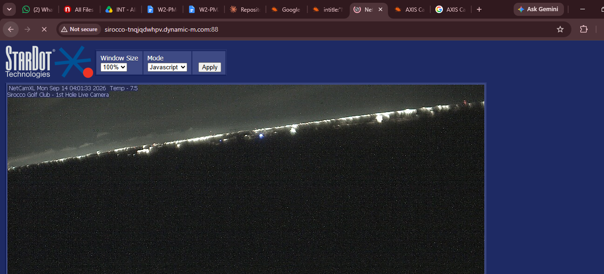
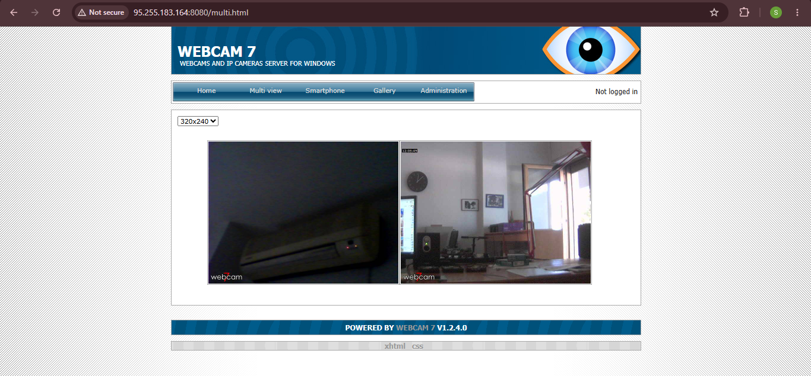
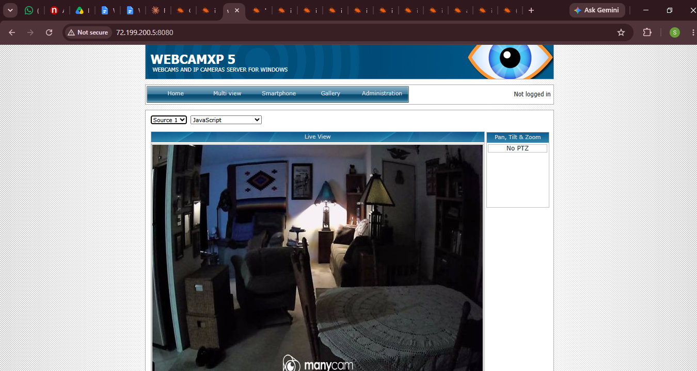
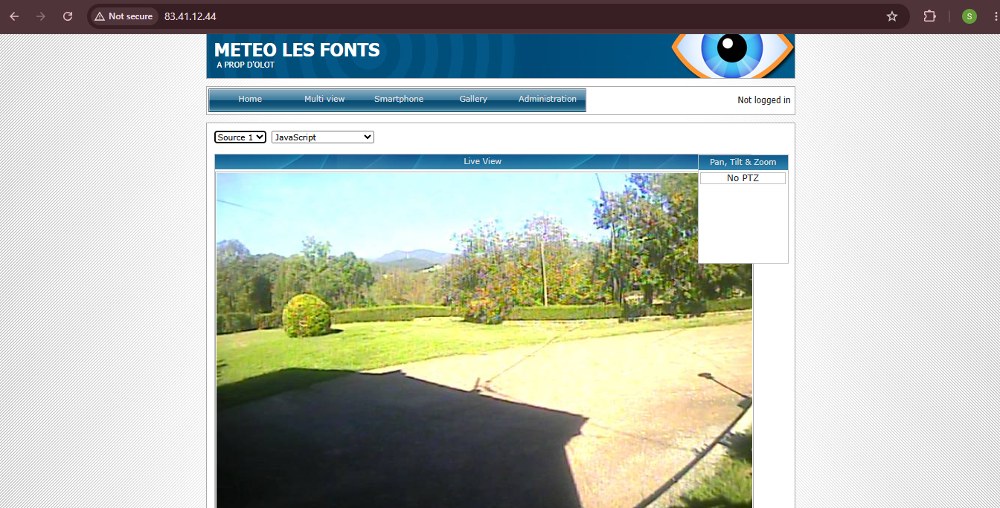
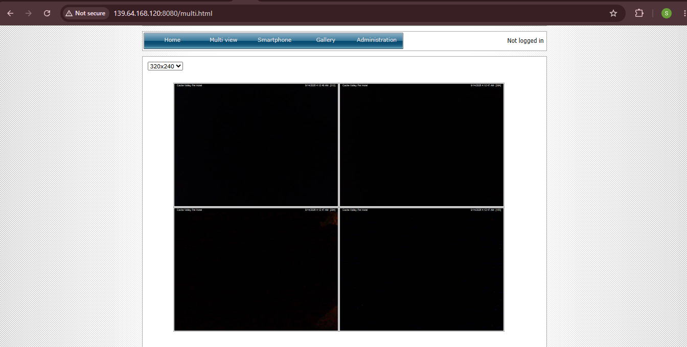
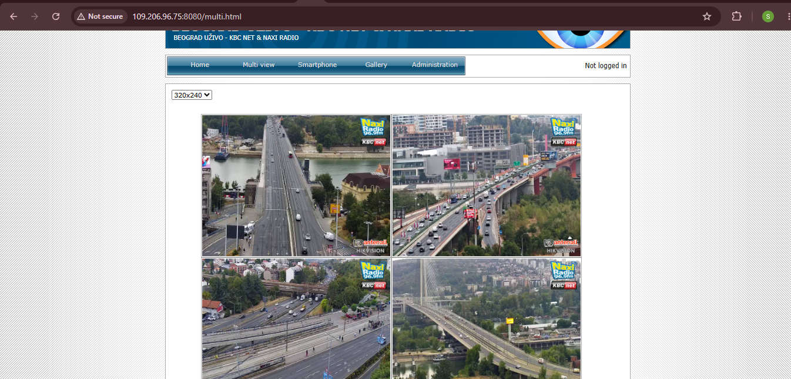
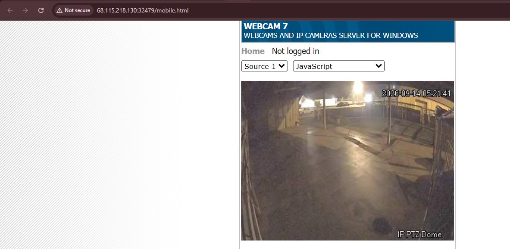
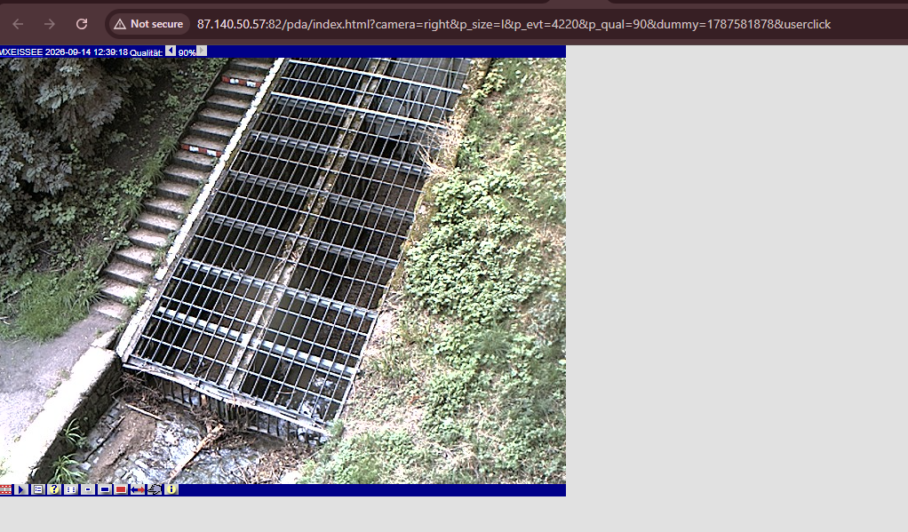
- `module3-footprinting-maltego/screenshots/` — Maltego installation + email harvesting result
- ### Screenshot
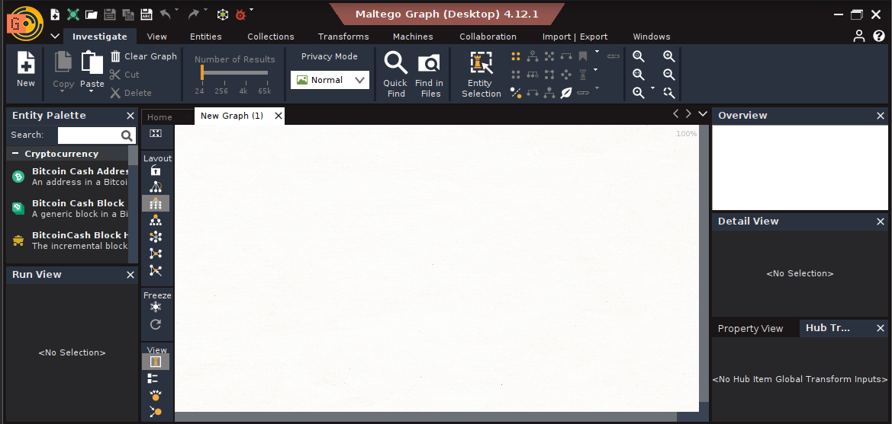
### Screenshot
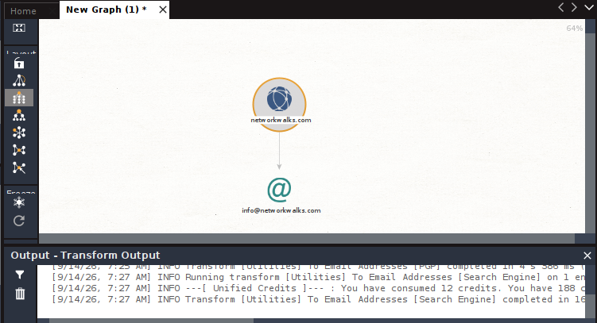
- `module4-footprinting-theharvester/screenshots/` — theHarvester Baidu results + all-sources results
- ### Screenshot
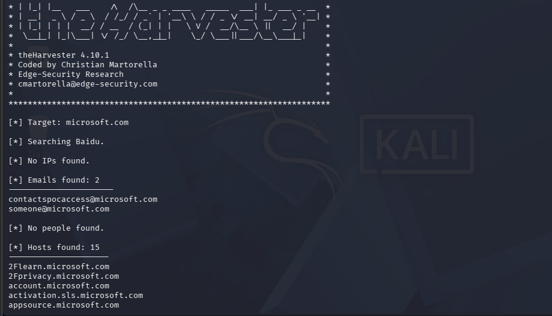
### Screenshot
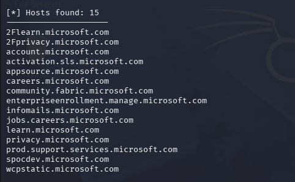
### Screenshot
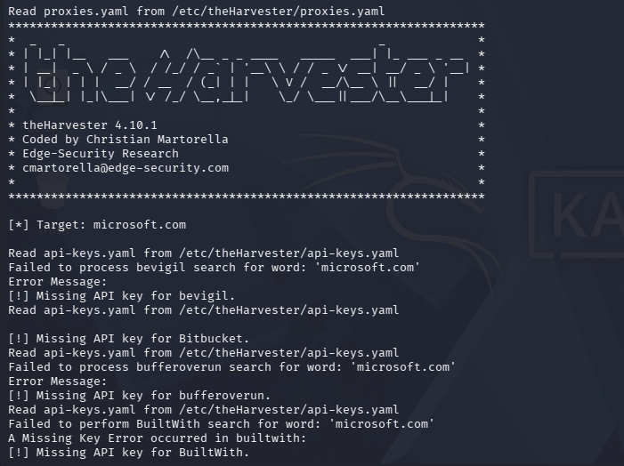
### Screenshot
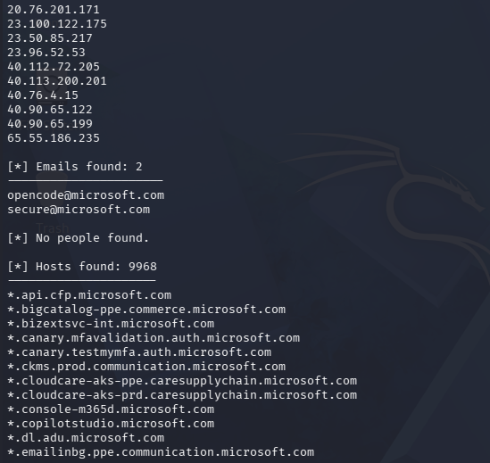
- `module5-network-scanning-zenmap/screenshots/` — Zenmap ping scan, host details, and topology PDF
- ### Screenshot

-### Screenshot

-### Screenshot

-### Screenshot

-End-

---

## 👤 Author

**Zain ul Abidin**

**Cyber Security Student B083**

---

## 📌 Project Information

**Program Name:** Cybersecurity program at Networkwalks | **Week:** 02 | **Repository:** GitHub
