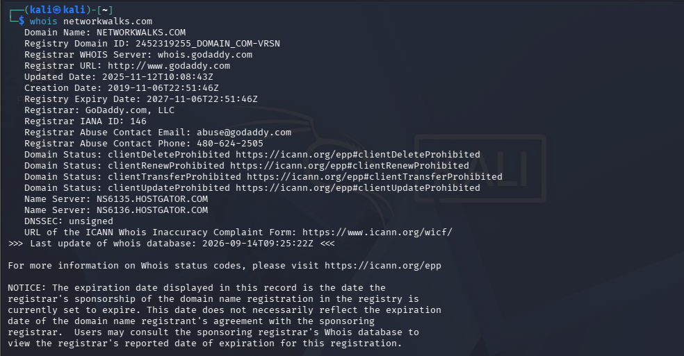
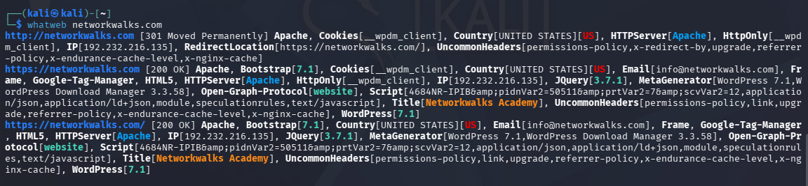
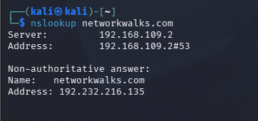
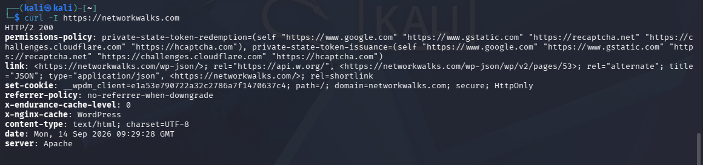
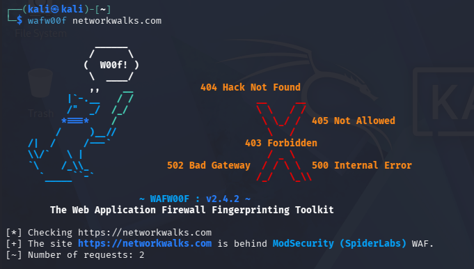
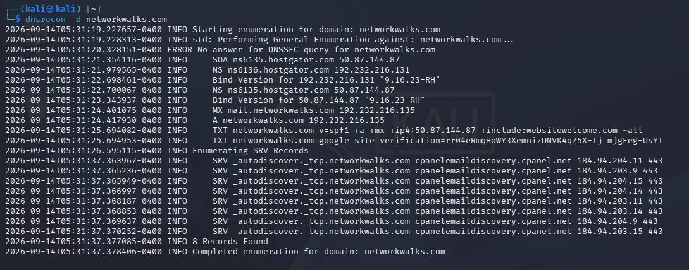

# NETWORKWALKS-EMMANUEL-B083-WK2-PM1-FOOTPRINTING-RECONNAISSANCE

**Footprinting & Reconnaissance Attacks with Multiple Kali Tools**

---

## 📌 Project Overview

This project focuses on performing **passive footprinting and reconnaissance** against a live target (`networkwalks.com`) using six built-in Kali Linux tools.

Footprinting is the first stage of any real attack or authorized security assessment — it involves quietly collecting publicly available information about a target before ever touching it directly.

---

## 🎯 Objectives

- Run `whois` to find domain registration details.
- Run `whatweb` to fingerprint web technologies.
- Run `nslookup` to resolve the domain to its IP address.
- Run `curl -I` to read HTTP response headers.
- Run `wafw00f` to detect a Web Application Firewall.
- Run `dnsrecon` to enumerate DNS records.
- Document every tool's output with screenshots and text files.
- Understand how each piece of information could be used by an attacker.

---

## 🛡️ Ethical Use

This lab is intended for **educational and authorized security testing only**.

Only test systems that you own or have explicit written permission to test.

---

# 🧠 Background

Reconnaissance (also called footprinting) is the first step in any real attack or security test. Before touching a target, an attacker quietly collects as much public information about it as possible — who owns the domain, its real IP address, the hosting provider, the web technologies it runs, its DNS and mail records, and whether a firewall is protecting it.

All of this comes from information the target has already made public, so the target never even knows it is being studied. This is why recon is powerful and very hard to detect.

The information gathered in this module forms the foundation for every later stage — scanning and attacking cannot be planned without first understanding the target.

---

# 🪜 Tasks & Solutions

## Task 1 — WHOIS Lookup

**Objective:** Query the public domain registration record to find who owns the domain, when it was registered, and its name servers.

**Command:**
```bash
whois networkwalks.com
```

### Screenshot


**How attackers use this:** whois reveals the registrar, registration/expiry dates, and name servers. Name servers reveal the hosting provider, and abuse contacts can help with social engineering and planning.

---

## Task 2 — WhatWeb Fingerprinting

**Objective:** Fingerprint the technologies running on the website — web server, CMS, plugins, frameworks, and IP address.

**Command:**
```bash
whatweb networkwalks.com
```

### Screenshot


**How attackers use this:** whatweb exposes the exact software and versions in use. An attacker can look up these versions in vulnerability databases to find known exploits. It also leaks the server IP and contact email.

---

## Task 3 — NSLOOKUP (DNS Resolution)

**Objective:** Resolve the domain name to its IP address using DNS.

**Command:**
```bash
nslookup networkwalks.com
```

### Screenshot


**How attackers use this:** nslookup turns a domain name into its real IP address. Knowing the IP lets an attacker scan the server directly, look up other sites hosted on the same IP, and map the target's infrastructure.

---

## Task 4 — HTTP Headers with cURL

**Objective:** Read the HTTP response headers to see the server banner, status, cookies, and redirects.

**Command:**
```bash
curl -I https://networkwalks.com
```

### Screenshot


**How attackers use this:** HTTP headers leak the web server, caching stack, and hidden endpoints (e.g. a WordPress REST API path). Attackers read headers to fingerprint the stack and find entry points without loading the full page.

---

## Task 5 — WAF Detection with wafw00f

**Objective:** Detect whether a Web Application Firewall (WAF) is protecting the target site.

**Command:**
```bash
wafw00f networkwalks.com
```

### Screenshot


**How attackers use this:** wafw00f tells an attacker if a firewall is watching. Knowing a WAF is present shapes the whole attack strategy — naive attempts will be blocked or logged, so the attacker must adapt or try to bypass it.

---

## Task 6 — DNS Enumeration with dnsrecon

**Objective:** Enumerate all DNS records — name servers, mail servers, SPF, TXT, and service (SRV) records.

**Command:**
```bash
dnsrecon -d networkwalks.com
```

### Screenshot


**How attackers use this:** dnsrecon maps the target's entire DNS footprint — mail servers, DNS software version, SPF policy, and service records. Each record is a potential foothold and helps an attacker understand the email and hosting setup.

---

# 💡 Why Footprinting Matters

Reconnaissance is the first stage of every real attack. Before touching a target, an attacker quietly builds a complete profile of it using only public information — exactly the tools used in this module.

`whois` and DNS tools (`nslookup`, `dnsrecon`) reveal who owns the domain, its real IP address, its hosting provider, and its mail servers. `whatweb` and `curl` fingerprint the exact software and versions running, which an attacker matches against known vulnerabilities. `wafw00f` warns them whether a firewall is watching, so they know how careful to be.

None of these tools attack the target — they only read what is already public. This is exactly why footprinting is so powerful and so hard to detect. The more an organization leaks, the easier every later stage of an attack becomes. This is also why defenders run the same tools on themselves: to see what an attacker would see, and to reduce it.

---

# 💡 What I Learned

### 1. Passive Reconnaissance
I learned how to gather information about a target without ever directly touching or attacking it, using only publicly available data.

### 2. Domain & DNS Investigation
I learned how to use `whois` and `dnsrecon` to uncover domain ownership, name servers, mail servers, and DNS records.

### 3. Web Technology Fingerprinting
I learned how `whatweb` and `curl` reveal the exact software, CMS, and versions running on a website, and how this information maps to known vulnerabilities.

### 4. Firewall Detection
I learned how `wafw00f` identifies whether a Web Application Firewall is protecting a target, and why this changes an attacker's approach.

### 5. Documentation
I learned how to properly record and organize reconnaissance findings with screenshots and text output, which forms the foundation for later scanning and attack planning.

---

# 🔐 Security & Ethical Use

This lab is created for learning and cybersecurity practice.

All testing was performed only on the designated lab target (`networkwalks.com`) as part of an authorized training exercise.

---

# 🔗 Tools Used

- **whois** — Domain registration lookup
- **whatweb** — Web technology fingerprinting
- **nslookup** — DNS resolution
- **curl** — HTTP header inspection
- **wafw00f** — Web Application Firewall detection
- **dnsrecon** — DNS record enumeration

---

# 👤 Author

**Emmanuel**

**Cyber Security Student B083**

---

## 📌 Project Information

**Program Name:** Cybersecurity at Networkwalks
**Week:** 02
**Project Module:** PM1 — Footprinting & Reconnaissance Attacks with Multiple Kali Tools
**Author:** Emmanuel
**B-Number:** B083
**Repository:** GitHub
