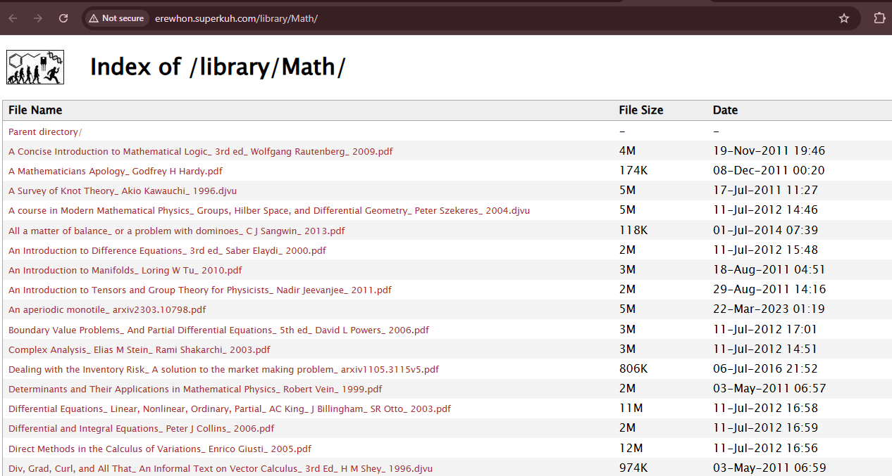
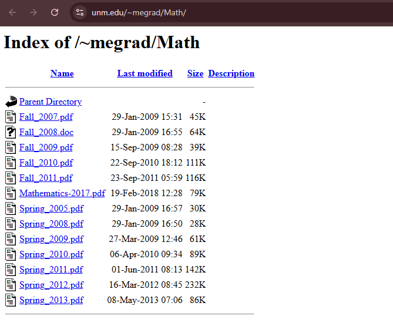
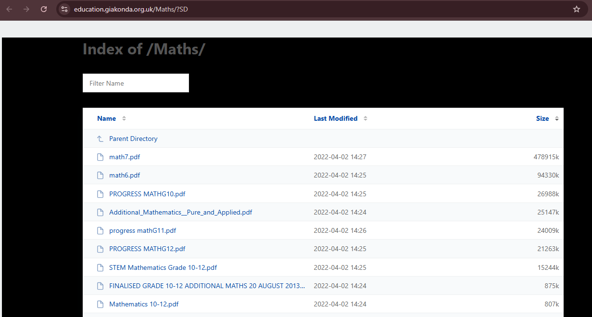
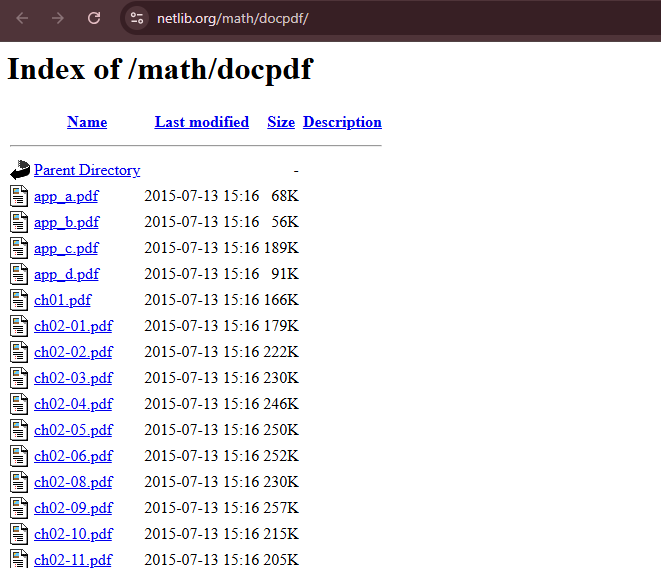
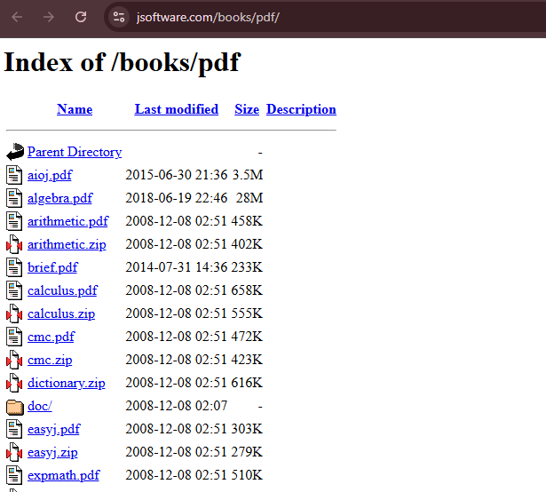
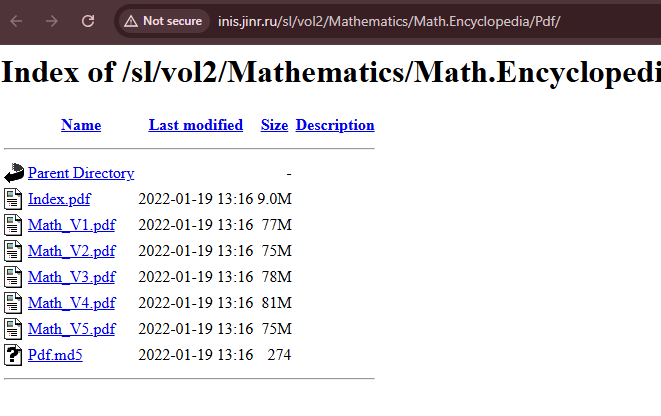
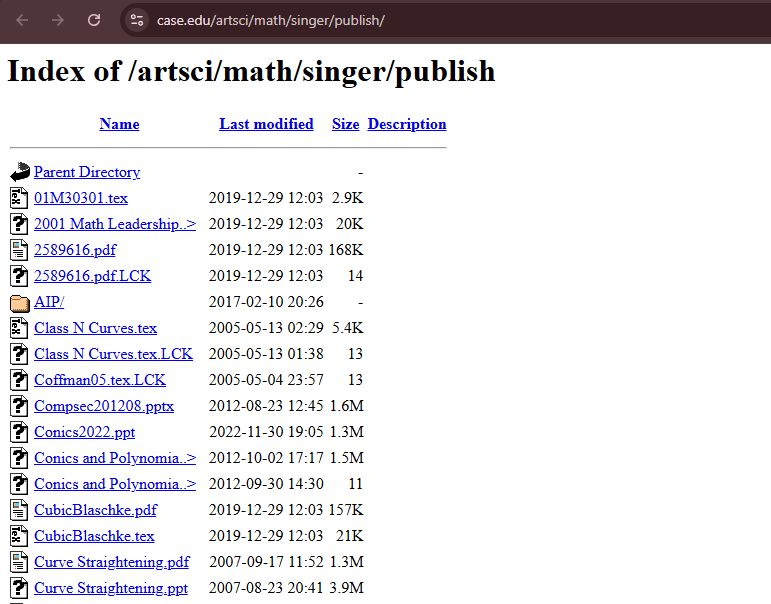
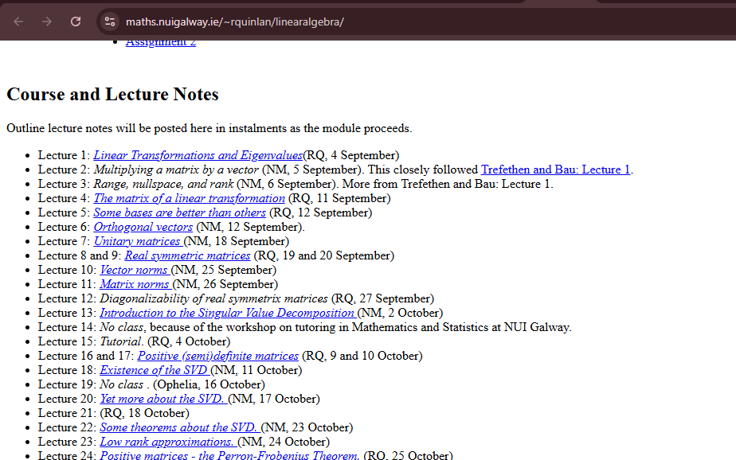
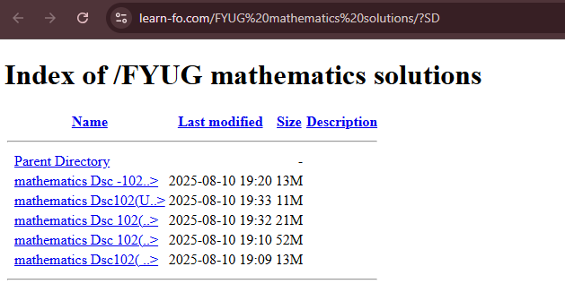
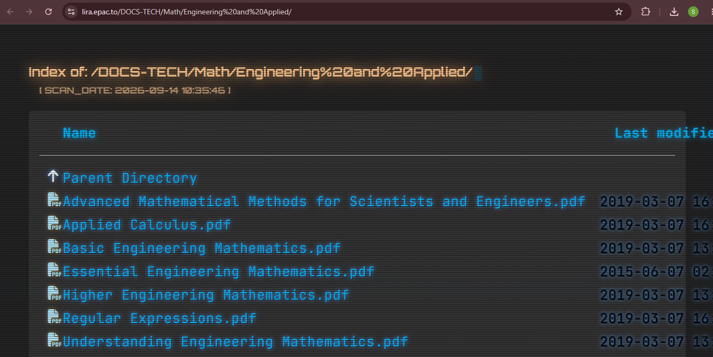

# NETWORKWALKS-EMMANUEL-B083-WK2-PM2-FOOTPRINTING-GHDB

**Footprinting & Reconnaissance Attacks with GHDB (Google Hacking Database)**

---

## 📌 Project Overview

This project focuses on using the **Google Hacking Database (GHDB)** to footprint live targets through Google search alone, without ever directly touching the target.

GHDB dorks turn ordinary Google search into a precise reconnaissance tool that can surface exposed devices and publicly leaked files that organizations never meant to publish.

---

## 🎯 Objectives

- Use GHDB (exploit-db.com) to find relevant Google dorks.
- Find 10x live, exposed security camera links accessible from the Internet.
- Find 10x listings containing downloadable mathematics ebooks in PDF format.
- Verify each result manually before recording it.
- Document every finding along with the exact dork used.

---

## 🛡️ Ethical Use

This lab is intended for **educational and authorized security testing only**.

All findings here come from publicly indexed Google results — no system was accessed beyond viewing what is already publicly exposed. No login was attempted, no files were downloaded, and no device settings were changed.

---

# 🧠 Background

GHDB (Google Hacking Database) is a large collection of ready-made search queries called Google dorks. These dorks use normal Google search operators in clever ways to pull out sensitive information that a website has accidentally left public — such as exposed camera feeds, open directories, login pages, config files, and documents.

GHDB was built for pentesters and security researchers so they can find and fix these leaks, and it is hosted on **www.exploit-db.com**.

Because all of this information comes straight from Google, the target is never contacted directly and never knows it is being studied — this makes GHDB one of the quietest and hardest-to-detect forms of footprinting.

---

# 🪜 Tasks & Solutions

## Task 1 — Exposed Security Cameras

**Objective:** Find 10x live, vulnerable security camera links that are exposed and accessible from the Internet, along with the relevant dork used for each.

**Solution Steps:**
1. Open `www.exploit-db.com`.
2. Click on **GHDB** from the left-side menu.
3. Search for a relevant term (e.g. `cam`).
4. Copy a dork from the results list one at a time.
5. Open `google.com` and paste the dork into the search bar.
6. Open the returned links one by one and verify which ones show a live, accessible camera feed without requiring login.
7. Repeat with different dorks until 10 live exposed cameras are found and logged.

### Findings

| No. | Link | Relevant Dork | Username/Password (if any) |
|---|---|---|---|
| 1 | http://109.233.191.130:8080 | `intitle:"webcamXP" inurl:8080` | --- |
| 2 | http://109.206.96.249:8080 | `intitle:"webcamXP" inurl:8080` | --- |
| 3 | http://sirocco-tnqjqdwhpv.dynamic-m.com:88 | `intitle:"NetCamXL"` | --- |
| 4 | http://95.255.183.164:8080/multi.html | `intitle:"webcam 7"` | --- |
| 5 | http://72.199.200.5:8080 | `intitle:"webcamXP" inurl:8080` | --- |
| 6 | http://83.41.12.44 | `intitle:"webcamXP" inurl:8080` | --- |
| 7 | http://139.64.168.120:8080/multi.html | `intitle:"webcam 7"` | --- |
| 8 | http://109.206.96.75:8080/multi.html | `intitle:"webcamXP" inurl:8080` | --- |
| 9 | http://68.115.218.130:32479/mobile.html | `intitle:"webcam 7"` | --- |
| 10 | http://87.140.50.57:82/pda/index.html | `intitle:"live view" camera` | --- |

### Screenshots


**How attackers use this:** Exposed camera dorks let an attacker locate live, unsecured video feeds without ever scanning or attacking a network directly. Many of these devices use default or no credentials, giving attackers surveillance access or even a foothold into a wider network.

---

## Task 2 — Downloadable Mathematics Ebooks (PDF)

**Objective:** Find 10x listings containing downloadable mathematics ebooks in PDF format, along with the relevant dork used.

**Solution Steps:**
1. Open `google.com`.
2. Search a directory-listing style dork (e.g. `intitle:index.of "parent directory" mathematics pdf`).
3. Open the listed results one by one and check which ones contain downloadable mathematics PDF ebooks.
4. Repeat with variations of the dork until 10 valid, unique listings are found and logged.

### Findings

| No. | Link | Relevant Dork | Username/Password (if any) |
|---|---|---|---|
| 1 | erewhon.superkuh.com/library/Math/ | `intitle:index.of "parent directory" mathematics pdf` | --- |
| 2 | unm.edu/~megrad/Math/ | `intitle:index.of "parent directory" mathematics pdf` | --- |
| 3 | education.giakonda.org.uk/Maths/ | `intitle:index.of "parent directory" mathematics pdf` | --- |
| 4 | netlib.org/math/docpdf/ | `intitle:index.of "parent directory" mathematics pdf` | --- |
| 5 | jsoftware.com/books/pdf/ | `intitle:index.of "parent directory" mathematics pdf` | --- |
| 6 | inis.jinr.ru/sl/vol2/Mathematics/Math.Encyclopedia/Pdf/ | `intitle:index.of "parent directory" mathematics pdf` | --- |
| 7 | case.edu/artsci/math/singer/publish/ | `intitle:index.of "parent directory" mathematics pdf` | --- |
| 8 | maths.nuigalway.ie/~rquinlan/linearalgebra/ | `intitle:index.of "parent directory" mathematics pdf` | --- |
| 9 | learn-fo.com/FYUG mathematics solutions/ | `intitle:index.of "parent directory" mathematics pdf` | --- |
| 10 | lira.epac.to/DOCS-TECH/Math/Engineering and Applied/ | `intitle:index.of "parent directory" mathematics pdf` | --- |

### Screenshots












**How attackers use this:** Open directory-listing dorks reveal unprotected folders on a web server. While ebook listings are usually harmless, the same technique is used by attackers to find exposed backups, configuration files, credentials, and internal documents left behind by misconfigured servers.

---

# 💡 Extra Dorks for Practice

```
allintitle: "Network Camera NetworkCamera"
intitle:"EvoCam" inurl:"webcam.html"
intitle:"Live View / - AXIS"
intitle:"LiveView / - AXIS" | inurl:view/view.shtml
inurl:indexFrame.shtml "Axis Video Server"
inurl:axis-cgi/jpg
inurl:"MultiCameraFrame?Mode=Motion"
inurl:/view.shtml
inurl:/view/index.shtml
"my webcamXP server!"
```

Exploit-DB also lists current exploits under its **Exploits** section, which is useful for further study and practice.

---

# 💡 Why GHDB Matters in Footprinting

Reconnaissance is the first stage of every real attack. Before touching a target, an attacker quietly builds a full picture of it using only public information, and Google is one of the richest sources of that information. Google constantly crawls and indexes almost everything a website exposes, so an attacker often does not need any special tool — just the right search.

This is where GHDB becomes powerful. Its dorks turn ordinary Google into a precise recon tool that surfaces exposed cameras, open folders, backup files, login portals, and leaked documents that owners never meant to publish. Because all of this comes straight from Google, the target is never contacted and never knows it is being studied, which makes GHDB one of the quietest and hardest-to-detect forms of footprinting.

The same dorks that an attacker uses to find weaknesses are also used by defenders to search their own domains, so they can discover what they are leaking and lock it down before someone else finds it. The lesson is simple: the less an organization exposes to Google, the smaller its attack surface becomes.

---

# 💡 What I Learned

### 1. Google Dorking Fundamentals
I learned how specialized search operators can be used to surface sensitive information that was never meant to be public.

### 2. Using GHDB as a Recon Resource
I learned how to navigate the Google Hacking Database on exploit-db.com to find categorized, ready-made dorks for different types of exposures.

### 3. Passive, Zero-Touch Reconnaissance
I learned that this entire technique never sends a single request to the target directly — everything comes from Google's own index, making it extremely difficult to detect.

### 4. Recognizing Valid vs Invalid Results
I learned that not every search result matches the task requirement — login-only pages, unrelated file formats, and duplicate IPs all had to be filtered out to keep only genuine, unique, live findings.

### 5. Real-World Impact of Misconfiguration
I learned how something as simple as an unprotected directory listing or a default-configured camera can expose an organization to real risk.

### 6. Documentation
I learned how to properly record dork-based findings with links, the exact dork used, and screenshots for a professional report.

---

# 🔐 Security & Ethical Use

This lab is created for learning and cybersecurity practice.

Only publicly indexed information was viewed. No login, download, or exploitation was attempted on any exposed system beyond verifying that a result matched the task.

---

# 🔗 Tools & Resources

- **Google Hacking Database (GHDB):** https://www.exploit-db.com/google-hacking-database
- **Exploit-DB:** https://www.exploit-db.com

---

# 👤 Author

**Zain ul Abidin**

**Cyber Security Student B083**

---

## 📌 Project Information

**Program Name:** Cybersecurity intern at Networkwalks
**Week:** 02
**Project Module:** PM2 — Footprinting & Reconnaissance Attacks with GHDB
**Author:** Zain ul Abidin
**B-Number:** B083
**Repository:** GitHub
